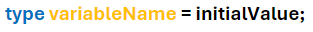
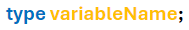
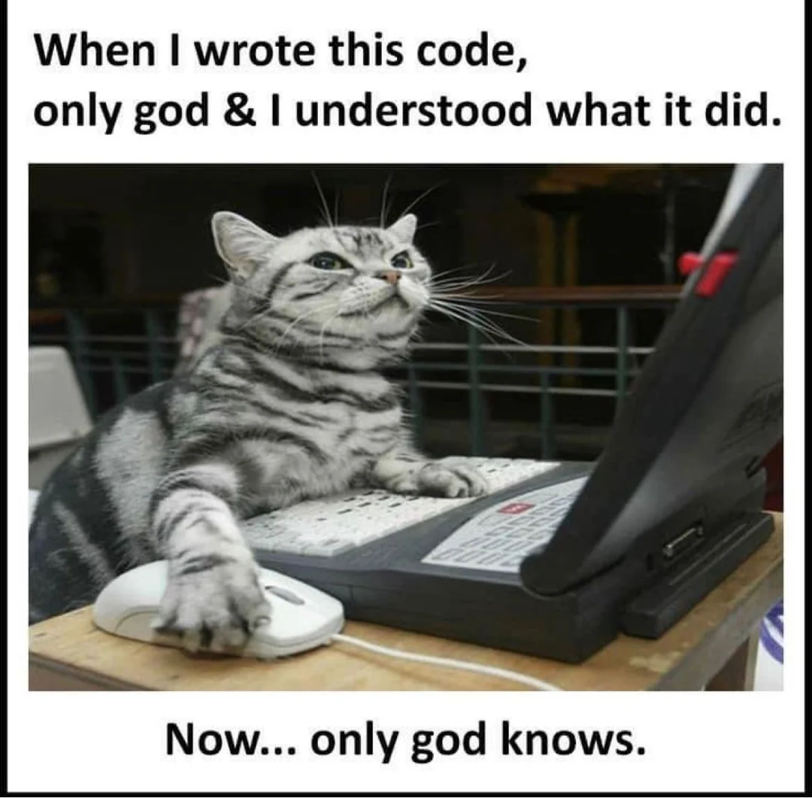
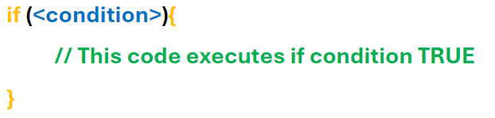
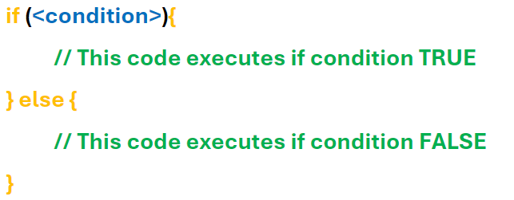
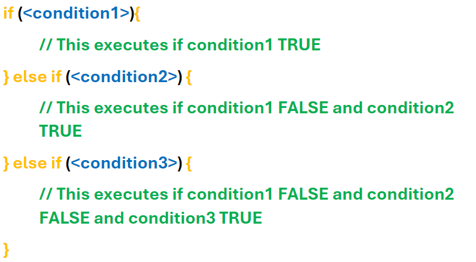
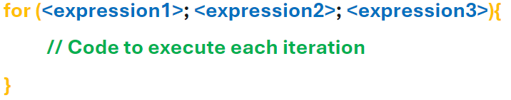
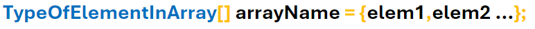
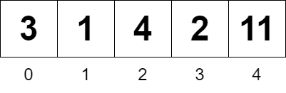

# Session 1 - An Introduction To C 

The course starts gently by introducing basic programming concepts in **C** such as variables, types, and loops. If you’re an experienced programmer then feel free to skim through these sections to get to the more **C**-specific parts! 

I would personally recommend doing all the exercises regardless of your level, to ensure that you know the material. At times, my writing can be verbose so please do skim through the content, scan for bold/italicised text, and carefully read content when you cannot do the corresponding exercises. 

Good luck and happy coding!
## Contents 

- <a href="#WhatIsC" style="color: black;"> What is C </a>
- <a href="#HelloWorld" style="color: black;"> Hello World! </a>
- <a href="#Compiling" style="color: black;"> Compiling & Running C Code </a>
    - <a href="#HelloWorldExercises" style="color: black;"> Compiling and Hello World Exercises </a>
- <a href="#Variables" style="color: black;"> Variable Declaration & Initialisation </a> 
- <a href="#Integers" style="color: black;"> Ints </a>
- <a href="#FormatSpecifiers" style="color: black;"> Format Specifiers (**%d**, **%s**, **%c**) </a>
    - <a href="#CharExercises" style="color: black;"> Int, Char, and Format Specifier Exercises </a>
- <a href="#Comments" style="color: black;"> Comments (and increment operator) </a>
- <a href="#IntegerTypes" style="color: black;"> More Integer Types (char, short, int, long, long long) </a>
    - <a href="#IntegerTypeExercise" style="color: black;"> Integer Type Exercise (size of types) </a> 
    - <a href="#OverflowUnderflow" style="color: black;"> Underflow/Overflow </a>
    - <a href="#Unsigned" style="color: black;"> Unsigned Integers  </a> 
    - <a href="#StdInt" style="color: black;"> StdInt Library </a> 
    - <a href="#IntegerExercises" style="color: black;"> Integer Exercises </a> 
- <a href="#IfStatements" style="color: black;"> Conditional Logic (If Statements) </a>
    - <a href="#IfStatementExercises" style="color: black;"> If Statement Exercises </a>
- <a href="#Floats" style="color: black;"> Floating-Point Types (Decimals) </a> 
    - <a href="#TypeCasts" style="color: black;"> Typecasting </a> 
- <a href="#ForLoops" style="color: black;"> For Loops </a> 
    - <a href="#ForLoopExercises" style="color: black;"> For Loop Exercises </a> 
- <a href="#Arrays" style="color: black;"> Arrays </a>
    - <a href="#ArrayExercises" style="color: black;"> Array Exercises </a>

## <a name="WhatIsC"> What is C </a>

**C** is a general purpose programming language that originated as the language for the UNIX Operating System. From its humble beginnings, **C** has been spread everywhere and it's highly likely that you'll be relying on **C** code every single day. Everything from airplane flight systems to version-control software like Git to applications you may be using right now relies on **C**. Even if you're coding something in a different language, it's likely that the interpreter/compiler is written in **C** and your machine is probably being held together by **C** and duck-tape. 

**C** is known for its mix of a high-level and low-level approach; you still get a decent amount of features that you see in languages like Python, but you can still interact pretty closely with the hardware like a low-level language does. Relatedly, it's known for having some pretty hard concepts like pointers and memory management but don't worry - we'll cover these in the course! 

Since it's a small language with minimal features (so you can write 🗲 lightning 🗲 fast code), **C** does not hold your hand. This course will help you through the stuff that **C** doesn't handle with concepts like Undefined Behaviour, and point out common pitfalls. 

## <a name="HelloWorld"> Hello, World! </a>

Let's start with the first program almost *everyone* writes. 

```c
#include <stdio.h>

main(){
    printf("hello world");
}
```

There are **3** main things to note already: 

1) The **stdio** library is the **st**an**d**ard **i**nput/**o**utput library which we’ll use to print text to the console. Think of **libraries** as a collection of tools that other people have coded so that we don't have to; typically a library is dedicated to *one thing* and I'm sure you can guess what **stdio** is dedicated to. 

We import it using the **include** *preprocessor directive*; don’t worry, we’ll learn more about what preprocessor directives are later! Just know that preprocessor directives start with a **#** (fun fact: also called an octothorpe), and that `#include <stdio.h>` tells **C** to copy all the code from stdio so that we get access to **printf** and everything else in that library.

2) All **C** programs start at the **main** function; not having a main will lead to an error! 

```
undefined reference to 'WinMain'
```

*The error I receive on my machine*

It is similar to Java’s main, which you may have already learned about in CS118, in that it is the first block of code run. 

If you don’t know what functions are yet, then just think of them as blocks of code. We will discuss them next session!

3) Statements in **C**, like using the **printf** function, end with a *semicolon*. This helps **C** read the program as semicolons tell it where one statement ends and another begins.  

Okay so we've seen our first **C** program but how do we actually run it? 

## <a name="Compiling"> Running C Code </a> 

If you're working on DCS machines, then you should have the GNU C compiler installed. 

If not then you should check by running the following command:
```sh
gcc --version
```
*gcc stands for GNU Compiler Collection* 

If you do not have it installed, then follow the installation instructions from [here](https://gcc.gnu.org/install/).

### What is a compiler? 

A compiler turns **high-level** code (such as **C**) into **low-level** machine code that the computer can run. 

The idea is that **C** code is relatively portable so you can write some **C** code, give that code to multiple different machines and they'll be able to run it using their respective compilers. In practice, since **C** often talks "directly" to Operating Systems, you will often have to write slightly different **C** code for different machines for complex programs.  


- Compiling **C** code turns it into an exe 
- You can run the exe with `./TheExe`

### <a name="CompilingAndExecuting"> Compiling and Executing C Code </a>

Use `gcc` to compile **C** code. As an example:

1) create a new file directly under the main folder (named C_Course-Introduction) 
2) Call it `exampleToCompile.c`
3) Run the command `gcc exampleToCompile.c -o exampleProgram`

This should give you an exe named `exampleProgram.exe` that you can run using:
```
./exampleProgram
```

Note that the `-o` flag lets you name the exe and, by extension, place it in a specific folder. If you wrote `exes/exampleProgram` instead of `exampleProgram`, then it would place the newly created program in the `exes` folder (assuming this folder exists). This will make it easier to keep track of your files! 

## <a name="HelloWorldExercises"> Exercises for Hello World & Compiling </a>

1) Compile one of the **C** files inside of `cFiles` (**hint:** use the <a href="#CompilingAndExecuting" style="color: black;"> <u>last paragraph of Compiling and Executing</u> </a> to help you)

2) Try changing up the text outputted to the console. Note that **C** does not automatically insert *newlines* after each usage of `printf`! 

```c
#include <stdio.h>

main(){
    printf("hello ");
    printf("world");
}
```

So the above code outputs:

```
hello world
```
*Key thing to note is that it's all on one line*

If you want a newline, use **\n** which stands for the *newline* character. 

```c
#include <stdio.h>

main(){
    printf("hello\n");
    printf("world");
}
```

Have fun writing your own output! 

## <a name="Variables"> Variables </a>  

So we can interact with the console using `printf` but we need a way of handling data; at the very least, we need a way of storing input when we start reading input from the user. 

**Enter variables!** 

Variables have:
- a **name**
- a **type** ( which tell you what kind of data is stored)
- a **value**, regardless of if you provide one! 

### Declaring with value



### Declaring without value 

 

This is the difference between **declaration** and **initialisation**. 

Both of these **declare** the variable (they tell **C** that memory must be reserved for the variable), but only the first **initialises** the variable with a value. In other words, **initialisation** is assigning the variable with a value. 

We will see later that the variable that isn’t initialised *does* have a value, but it might not be what you expect! 

## <a name="Integers"> Integer variables </a> 

First, we’ll explore the integer (positive & negative whole number) types! 

```c
#include <stdio.h>

main(){
    int a = 5;
    int b, c;

    b = 1; 
    c = -4;

    printf("%d\n", a + b + c);
}
```
*A program with a variety of int initialisations*

```
2
```

1) Note the different ways we’ve initialised the variables a,b,c- all valid! 

2) Note the use of `+` as an operation for integers (and numbers in general). You also get `-` for subtraction, `*` for multiplication, `/` for division. 

3) Notice that we’re using `printf` differently. The previous use of `printf` was just passing it a piece of text; this current use of `printf` passes it a formatting piece of text (`%d\n`), and the values to slot into the format. 

As it’s useful to output values in meaningful ways for debugging complex programs and even outputs for simple command-line programs, we’ll take a closer look at using `printf`. 

## <a name="FormatSpecifiers"> Format Specifiers (using printf) </a>

The formatting piece of text includes **format specifiers** which begin with **%** and are replaced by the other values you pass `printf`; different values (or different ways of displaying values) require different format specifiers. 

For example, **%d** is used to stand in for a regular old base 10 integer (**d** for **d**ecimal). The pieces of text that we’ve been passing are called **strings** and so use **%s**. 

```c
#include <stdio.h>

int main(){
    int hours = 11;
    int minutes = 23;
    int seconds = 59;

    printf("%s - %d : %d : %d \n", "The Time",  hours, minutes, seconds);
}
```
*Example for time using both **%s** and **%d***

```
The Time - 11 : 23 : 59
```

What did I mean by **“different displays of values”**? To explain, I will introduce the **char** which is a *smaller* **int** data type, with a *tiny* range of possible values (`-128` to `+127`), that is typically used to represent *characters* using **ASCII** rather than to represent integers. 

For those who don’t know, ASCII is a standard encoding of *integers* to commonly used *characters*. To show a few:

<table>
    <tr>
        <th> Integer </th>
        <td> 65 </td>
        <td> 66 </td>
        <td> 67 </td>
        <td> 97 </td>
        <td> 98 </td>
        <td> 99 </td>
        <td> 33 </td>
        <td> 35 </td>
    </tr>
    <tr>
        <th> Character </th>
        <td> A </td>
        <td> B </td>
        <td> C </td>
        <td> a </td>
        <td> b </td>
        <td> c </td>
        <td> ! </td>
        <td> # </td>
    </tr>
</table>

Of course the **digits** must be encoded too; they’re encoded by the numbers **48**-**57**.

<table>
    <tr>
        <th> Integer </th>
        <td> 48 </td>
        <td> 49 </td>
        <td> 50 </td>
        <td> 51 </td>
        <td> 52 </td>
        <td> 53 </td>
        <td> 54 </td>
        <td> 55 </td>
        <td> 56 </td>
        <td> 57 </td>
    </tr>
    <tr>
        <th> Character </th>
        <td> 0 </td>
        <td> 1 </td>
        <td> 2 </td>
        <td> 3 </td>
        <td> 4 </td>
        <td> 5 </td>
        <td> 6 </td>
        <td> 7 </td>
        <td> 8 </td>
        <td> 9 </td>
    </tr>
</table>

So a char can be displayed as a *number* using **%d**, but also as a *character* using **%c**.

```c
char a = 101;
printf("%c : %d", a, a);
```
*Two different ways of displaying the same value: as the character the char represents, and the corresponding number itself*

```
e : 101
```

As a **char** can represent a fraction of the values an **int** can, an int can also be used to store and display a character since it can be converted into a char very easily. So the following code is also valid:

```c
int b = 100;
printf("%c : %d", b, b);
```
*Displaying both representations using an int instead of a char*

```
d : 100
```

If you’re concerned about not being able to display the **%** symbol, fret not! You can do this using **%%** which displays a single **%**. 

### <a name="CharExercises"> Exercises for using ints and chars </a> 

1) There are two groups in a room: `6` UWCS Exec and `20` C Programmers. `4` people in this room are both UWCS Exec and C Programmers. Finish the following C program in order to complete the total number of people in the room: 

```c
#include <stdio.h>

main(){
    int exec = 6; 
    int cProgrammers = 20;
    int both = 4;

    int total; 

    printf("The total number of people: %d", total);
}
```

2) Try to spell your name out using chars! If you’re feeling ambitious, try doing this using a mixture of capital and lower case letters. Refer to [this if needed](https://www.asciitable.com/).

To make this easier, you can set the value of a char using the character that it represents. For example:

```c
char capitalE = 'E';
```
*Note that characters are wrapped in single quotes*

3) Timmy wants to display how charged an attack is in his game! Can you help him output the text: 
```
Laser is charging, at 57% now! 
``` 

His current code is: 
```c
#include <stdio.h>

main(){
    int charge = 57;

    printf("FILL ME IN");
}
```

## <a name="Comments"> Break from ints: Comments </a> 

We’ll be using **comments** to help *describe* and *explain* bits of code; they don’t do anything to the execution of the program, but you should use comments in your own **C** programs to help the reader quickly understand what is going on (often you in the future)! 



Use **//** for single-line comments. Let’s see how they’re used to showcase the *increment* operator (**++**), which increases a number by 1. 

```c
main(){
    int i = 5; 
    i++;

    printf("%d\n", i); // output: 6 

    i++;
    i++;

    printf("%d\n", i); // output: 8 
}
```
*Use of single-line comments*

If you need to write something longer, then consider using **multi-line comments**. 

To start a multi-line comment, use **/\***

To end a multi-line comment, use **\*/**

```c
#include <stdio.h>

/*
    The main function is the entry-point to the program.
    This program shows the increment operator on integers, and its effect. 
    The main purpose of this program is to demonstrate the use of comments. 

    (This is a multiline comment)
*/
main(){
    int i = 5; 
    i++;

    printf("%d\n", i); // output: 6 

    i++;
    i++;

    printf("%d\n", i); // output: 8 
}
```
*The full program with a multi-line comment describing main*

Try to practice using **single-line** and **multi-line** comments in future exercises to get used to them!

## <a name="IntegerTypes"> Which int to use? </a> 

There are several **ints** (char, short, int, long, long long) to choose from, and generally you should choose them based on *what they’re used for* e.g. *chars* for representing *characters*, *shorts* for *small integers*, *longs* for *large integers*. 

For most use cases, the size taken up by an integer is negligible so most people tend to default to an int in a place where a short would be perfectly fine. This only really matters in situations where space is very valuable such as small embedded systems or storing **a lot** of integers. In fact, it can be beneficial to use an int as your future uses may require a larger range and arithmetic can actually be faster (although usually negligibly) if your machine’s native size is 32-bit or 64-bit. 

Despite the idea of **C** being a portable language, the size (and range) of integer types are machine-dependent; therefore, the **C** standard only specifies the *minimum* number of bytes for each type. 

For instance, the minimum number of bytes for an **int** is `2` however most modern machines use `4`.

| Type                              | (Minimum) number of bytes | (Minimum) range of values      | 
| --------------------------------- | ------------------------- | ------------------------------ |
| char                              | `1`                       | `-128` to `+127`               |
| short (aka short int)             | `2`                       | `-32768` to `+32767`           |
| int                               | `2`                       | `-32768` to `+32767`           |   
| long (aka long int)               | `4`                       | `-2147483648` to `+2147483647` |   
| long long (aka long long int)     | `8`                       | `-2^63` to `+2^63 - 1`         |

The longs even come with their own format specifiers: **ld** (for long) and **lld** (for long long).

### <a name="IntegerTypeExercise"> Integer Type Exercise: Outputting the size of types </a>

1) We know the *minimum* number of bytes that a type must have, but how do we know what the *actual* number of bytes is for *your* machine? Well, wouldn't you like to know you nosy little scamp! 

You can use the `sizeof` function to do this. For example: 

```c
printf("Size of an int (in bytes): %d\n", sizeof(int));
```

Try to write out a C program that prints out the size of all 5 of the above types. 

## <a name="OverflowUnderflow"> Overflow/Underflow - What if the number goes above/below the range? </a>

Having ranges of values for integers begs the question: "What if you go above or below the range?"

- Going *above* the range (**overflow**) of an int type will wrap around to the *minimum* value. 
- Similarly, going *below* the range (**underflow**) of an int type will wrap around to the *maximum* value. 

```c
#include <stdio.h>

main(){
    char maxVal = 127;
    maxVal++; // integer overflow! 

    printf("%d\n", maxVal); // output: -128

    char minVal = -128; 
    minVal--; // integer underflow! 

    printf("%d\n", minVal); // output: 127
}
```
*Note that the decrement operator (`—`) subtracts `1` from a number.*

## <a name="Unsigned"> What if I want only positive numbers? </a>

The standard integers we are using so far are **signed** integers. As in, they have a **sign** (*positive* or *negative*). If you want to use only the positive range, then you can use unsigned integers by adding *“unsigned”* in the type! 

Since they don't represent negative integers, you roughly **double** the number of positive integers you can use.

## <a name="StdInt"> What if I want a guaranteed size? </a>

If the exact size of the int is crucial, you can use the **stdint** (`<stdint.h>`) library. 

| Type      | Number of bytes | Range of values     |
| --------- | --------------- | ------------------- |
| int8_t    | 1               | -2^7 to 2^7 - 1     |
| int16_t   | 2               | -2^15 to 2^15 - 1   |
| int32_t   | 4               | -2^31 to 2^31 - 1   |
| uint8_t   | 1               | 0 to 2^8 - 1        |
| uint16_t  | 2               | 0 to 2^16 - 1       |
| uint32_t  | 4               | 0 to 2^32 - 1       |

Most modern implementations also provide **int64_t** and **uint64_t**. 

### <a name="IntegerExercises"> Integer Exercises </a>

1) In variable initialisation, I said that uninitialised variables *do* have a value but they might not be what you expect! Write a program to declare some variables (without initialising), and see what values they have! If you don't know where to start, here are some uninitialised variables: 
```c
int a,b,c,d,e;
```

2) Once you've finished Exercise 1, have a read through the explanation in the solution file (`cFiles/exerciseSolutions/IntegerExercises/Exercise1.c`). 

3) Write a program which imports **stdint** and prints the size of each type mentioned above; verify that they really are that size! 

## <a name="IfStatements"> Conditional Logic (If Statements) </a>

Doing certain things under certain conditions is *essential*. The basics of this is the if statement:



An example of its use: 
```c
int age = 19; // my current age 

if(age >= 18){
    printf("Yay I can vote!");
}
```

We can see that the `<condition>` - in this case, whether I am older than 18 - is **True** or **False**; that is, each `<condition>` has a value of **True** or **False** (called **boolean** values). However booleans do not have their own type in **C**; this begs the question: "what actually is `<condition>`?" 

Well, **False** is actually represented by `0` and **True** is represented by anything *except* `0`. Let's see what value **C** assigns our condition with.  

```c
int age = 19; // my current age
int isOver18 = (age >= 18); // you can use brackets to ensure things inside happen first

printf("True: %d", isOver18); // 1 
```

Wow that's fun! So `0` is typically used for **False** and `1` is used for **True**? This totally isn't foreshadowing anything in Session 2. 

We can already do a lot with just this, but we can make the if statement more *powerful* with **else**s:



We can make these even more *powerful* with **else if**s:



### <a name="IfStatementExercises"> If Statement Exercises </a>

1) You can combine conditions with AND (`&&`) and OR (`||`), such as in `(x > 3) && (x < 7)` (x is between `3` and `7`). 

Amy is programming a game and only wants to let a player fire a spell when they're in range (within `3` cells), have enough mana to cast (`35` points), and are not on cooldown (`2000` milliseconds). Finish her code (and turn it into an executable C program).

```c 
int mana = 70; // mana points
int lastCast = 1500; // milliseconds
int distance = 3; // cells/blocks 

// IF SUCCESSFUL
printf("Cast spell!");
// IF NOT SUCCESSFUL
printf("Cannot cast spell!");
```

2) Change your solution to Exercise 1 so that the user knows *why* they can't cast the spell (did they run out of mana? are they within range?)

## <a name="Floats"> Representing Decimals: Floating-Point Numbers </a>

Before we cover the pure *joy* of for loops, here's a quick word from our sponsor. 

```
Aren't you tired of having to use boring old integer types? Not even being able to use 0.5 or more exciting numbers? Doing 3/2 and getting 1? It makes no sense!

Introooooduccingggggg floating-point types!
These guys will perk your code right up with ✨decimal numbers✨

We've got float for all your basic decimal needs, and if you need a *little* extra precision then we've got the ultra-premium-deluxe d o u b l e type! 
Not enough for you? We've got *just* the type for you! looooong double! 
```

- **float** can store decimals with precision up to 6-7 decimal places. 
- **double** can store decimals with precision up to 14-15 decimal places. 
- **long double** can store decimals with precision up to 18 decimal places. 

These guys also come with their own *format specifiers*: **%f** (for floats), **%lf** ("long float" for doubles), and **%Lf** ("LONG float" for long doubles). 

###  <a name="TypeCasts"> Type Casting </a> 

When we saw that integers can be displayed as characters, we were actually converting integers to characters first: this is a **type cast**. 
Specifically, it's an **implicit** type cast since you didn't have to tell **C** to cast; it just does it for you. 

Sometimes, though you'll need to **explicitly** type cast. 


*How you write (syntax) for explicit typecasts*

Let's do `3/2` like the ad promised, and we can see why explicit casting is useful: 

```c
#include <stdio.h>

main(){
    int a = 3;
    int b = 2;

    float result = a/b; // Without explicit casting
    printf("%f\n", result); // 1.000000

    result = (float) a / (float) b; // With explicit casting
    printf("%f\n", result); // 1.500000
}
```

The first example is doing the integer division *first* and then converting the integer `1` to a float. 
The second example is converting `3` and `2` to floats first, and then doing the division. 

### <a name="FloatingExercises"> Floating-Point Exercises </a>

1) We've got new types! You know what that means; we've got to check the sizes of them. Write a program to determine the sizes of these new types. 

## <a name="ForLoops"> For loops </a>

Ever wanted to do something *over and over again* a set number of times? Or do something again and again until something changes? You can use a **for loop** for that! 



- Expression/Statement 1 (start) is executed at the start; we'll use it to initialise a variable to keep track of how many times we've looped
- Expression 2 (condition) is a condition that we check at the start of each loop; if it's true, then we keep looping 
- Expression 3 (update) is executed after each loop (if we decide to keep going)

For example, the following is a valid for loop:
```c
for(int i = 0; i < 4; i++){
    printf("%d ", i);
}
```
We call each time we go through the loop an *iteration* and if we're looping, then we are said to be *iterating* through the loop. 
This particular loop iterates `4` times (for `i = 0, 1, 2, 3`).

**Fun fact:** Before C99, you had to declare variables outside of the for loop so they'd look like this:
```c
int i; 

for(i = 0; i < 4; i++){
    printf("%d ", i);
}
```

### <a name="ForLoopExercises"> For Loop Exercises </a>

1) You can increment a variable by more than 1 by doing the following: 
```c
int a = 5;
a = a + 3; // incrementing a by 3 
```

You can write this as:
```c
int a = 5;
a += 3;
```

Can you use a for loop and an int n to sum all the integers from 1 to n? 

2) Can you use a for loop to square then sum all of the even integers from 1 to n? 

**Hint:** We can use `+=` in the *update* part of the for loop. 

3) You can nest for loops by putting them inside each other, like so:

```c
for (int i = 0; i < 5; i++){
    for (int j = 0; j < 5; j++){

    }
}
```
So for every value of `i`, the inside loop will run `j` times (for `j = 0, 1, 2, 3, 4`). Therefore, the inside loop will run `25` times. 

Can you write a program to output all the ways to add integers from `1 to a` and `1 to b`? For example, for `a=2` and `b=3`: 
```
1 + 1 = 2
1 + 2 = 3
1 + 3 = 4
2 + 1 = 3
2 + 2 = 4 
2 + 3 = 5
```

4) Can you edit your solution to Exercise 3 so that some ways aren't repeated? For example, in the above, `1 + 2 = 3` is repeated later as `2 + 1 = 3`. 

## <a name="Arrays"> Arrays </a>

So far, we've dealt with variables with just one value; this can't really be expanded that far. Imagine having `100` grades and trying to sum them all; it'd be insane to have a variable for each one! 

So we use **arrays** which are a collection of values. The values are stored in contiguous memory locations which is a fancy way of saying that the values are stored *right next to each other*. 

We can initialise an array in **C** like this: 
```c 
int[] anArray = {3, 1, 4, 2, 11};
```

So the syntax is: 



But how do we do anything with it? 

### Indexing 

We call accessing elements of the array **indexing**. We index using **[]**, but be careful! Indexing in **C** starts at 0, so the first element in the array is actually the **0th** element.


*A visualisation of the initialised array, with indexes below the cells*

```c
float[] yearAverages = {71.4, 69.2, 55.4, 80.1, 76.4, 66.3, 48.0, 57.6, 66.1, 62.3};

printf("%f\n", yearAverages[0]); // first grade in array

float theThirdGrade = yearAverages[2];

printf("%f\n", theThirdGrade);

yearAverages[1] = 70.0; // changing a value in the array
```

Of course, we can have arrays of floats or ints or chars; you name it. In fact, we've been secretly dealing with an array of chars this entire time: a **string** is just an array of characters. 

### Declaring 

We've seen how to *initialise* an array straight away, but what about if can't write the elements directly into the array. What if they're inserted from a file or some other location (not written directly in the code).

We can **declare** the array like so:
```c
int[5] anArray;
```

Note that we *have to* provide a size for **C** to give us enough space. If you define the elements straightaway with `{}`, then **C** figures out the size of the array for you.

### Size of an Array 

We can use `sizeof()` on arrays, and it gives us the size taken up by the entire array. Since an array contains elements of the same type, we can use this to determine the number of elements in a given array by doing `sizeof(array)/sizeof(array[0])`. Can you explain why? 

We will cover arrays more deeply next week when we explore pointers.

### <a name="ArrayExercises"> Array Exercises </a>

1) Given the array:
```c
int[] numbers = {4, 5, 3, 2, 9, 17, 1, 4};
```

Can you calculate the average for this array (using a for loop)?

2) Given the yearAverages array in the Arrays section, can you print all of the grades equal to or above a 2:1 (`60`)?

3) Declare an array but don't initialise the values. Print them; what do you get? 

4) Read the solution for exercise 3. 

## Next Session…

Well done on making it through Session 1 alive! 

Next session, we’ll be covering arguably the most important and famous topic in C: pointers. 
We'll start with how to make our code a little more organised and powerful (now that we know some more advanced concepts) with functions. 

Hope to see you there! 

## Acknowledgements

Thanks to Alia Meek for helping proof-read the session. 
Originally created by Edward Denton. 