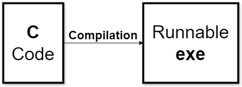

# Session 1 - An Introduction To C 

## About the session  

The course starts gently by introducing basic programming concepts in C such as variables, types, functions, and loops. If you’re an experienced programmer then feel free to skim through these sections to get to the more C-specific parts! 

## What is C

C is a general purpose programming language that originated as the language for UNIX ….

## Hello, World! 

Let's start with the first program almost *everyone* writes. 

```c
#include <stdio.h>

main(){
    printf("hello world");
}
```

There are a few things to note already: 

1) The stdio library is the standard input/output library which we’ll use to print text to the console. We import it using the include *preprocessor directive*; don’t worry, we’ll learn more about what preprocessor directives are later!

Just know that preprocessor directives start with a # (fun fact: also called an octothorpe), and that #include <stdio.h> tells C to copy all the code from stdio so that we get access to printf and everything else in that library.

2) All C programs start at the main function; not having a main will lead to an error! 

```
undefined reference to 'WinMain'
```

*The error I receive on my machine*

It is similar to Java’s main, which you may have already learned about in CS118, in that it is the first block of code run. 

If you don’t know what functions are yet, then just think of them as blocks of code. We will discuss them soon!

3) Statements in C, like using the printf function, end with a semicolon. This helps C read the program as semicolons tell it where one statement ends and another begins.  

## Running C Code 

If you're working on DCS machines, then you should have the GNU C compiler installed. 

If not then you should check by running the following command:
```
gcc --version
```
*gcc stands for GNU Compiler Collection*

If you do not have it installed, then follow the installation instructions from [here](https://gcc.gnu.org/install/).

### What is a compiler? 

A compiler turns high-level code (such as C) into low-level machine code that the computer can run. 

The idea is that C code is relatively portable so you can write some C code, give that code to multiple different machines and they'll be able to run it using their respective compilers.  


- Compiling C code turns it into an exe 
- You can run the exe with `./TheExe`

### Compiling and Executing C Code

## Exercise for Hello World 

1) Try changing up the text outputted to the console. Note that C does not automatically insert newlines after each usage of printf! 

(image: Code with no newline [these code and output screenshots won't be needed when we have Jupyter running])So the above code outputs: 

(image)If you want a newline, use \n which stands for the newline character. 

(image: Corrected code has newline)Mention when introducing functions properly, that void can be used to mean “no parameters”

Variables  

So we can interact with the console using printf but we need a way of handling state; at the very least, we need a way of storing input when we start reading input from the user. 

Enter variables! 

Variables have a name and a type (for what kind of data is stored). They also hold a value regardless of if you provide one! 

Declaring with value

(image: Declaring a variable with a value )Declaring without value 

(image: Declaring a variable without specified value )This is the difference between declaration and initialisation. 

Both of these declare the variable (they tell C that memory must be reserved for the variable), but only the first initialises the variable with a value. 

We will see soon that the variable that isn’t initialised does have a value, but it might not be what you expect! 

Integer variables 

First, we’ll explore the integer (positive/negative whole number) types! 

(image: Using integers)1) Note the different ways we’ve initialised the variables a,b,c- all valid! 

2) Notice that we’re using printf differently. The previous use of printf was just passing it a piece of text; this current use of printf passes it a formatting piece of text, and the values to slot into the format. 

As it’s useful to output values in meaningful ways for debugging complex programs and even outputs for simple command-line programs, we’ll take a closer look at using printf. 

Format Specifiers (using printf)

The formatting piece of text includes format specifiers which begin with % and are replaced by the other values you pass printf; different values (or different displays of values) require different format specifiers. 

For example, %d is used to stand in for a regular old base 10 integer (d for decimal). The pieces of text that we’ve been passing are called strings and so use %s. 

(image: Example for time using %s, %d )(image)What did I mean by “different displays of values”? There’s a smaller int data type called a char, with a tiny range of possible values (-128 to +127), and it’s typically used to represent characters using ASCII rather than integers. 

For those who don’t know, ASCII is a standard encoding of integers to commonly used characters. To name a few: 65 is ‘A’, 66 is ‘B’, 67 is ‘C’; 97 is ‘a’, 98 is ‘b’, 99 is ‘c’; 33 is ‘!’, 35 is ‘#’. Of course the digits too; they’re encoded by the numbers 48-57. 

So a char can be displayed as a number using %d, but also as a character using %c.

(image: Displaying both the character the char represents, and the number itself)(image)As a char can represent a subset of the values an int can, an int can also be used to display a character as it can be converted into a char very easily. So the following code is also valid:(image: Displaying both representations using an int)

(image)If you’re concerned about not being able to display the % symbol, fret not! You can do this using %% which displays a single %. 

Exercise for using chars 

1) Try to spell your name out using chars! If you’re feeling ambitious, try doing this using a mixture of capital and lower case letters. 

Break from ints: Comments 

We’ll be using comments to help describe and explain bits of code; they don’t do anything to the execution of the program, but you should use comments in your own C programs to help the reader quickly understand what is going on (often you in the future)! 

(image)Use // for single-line comments. Let’s see how they’re used to showcase the increment operator (++), which increases a number by 1. 

(image: Use of single-line comments )If you need to write something longer, then consider using multi-line comments. 

To start a multi-line comment, use /*

To end a multi-line comment, use */

(image: The full program; take note of the multi-line comment)Try to practice using comments in the exercises to get used to them!

If someone asks about Javadocs or a universal standard, send them https://www.doxygen.nl 

Which int to use? 

There are several ints (char, short, int, long, long long) to choose from, and generally you should choose them based on what they’re used for e.g. chars for representing characters, shorts for small integers, longs for long integers. 

For most use cases, the size taken up by an integer is negligible so most people tend to default to an int in a place where a short would be perfectly fine. This only really matters in situations where space is very valuable such as small embedded systems or storing a lot of integers. In fact, it can be beneficial to use an int as your future uses may require a larger range and arithmetic can actually be faster (although usually negligibly) if your machine’s native size is 32-bit or 64-bit. 

Despite the idea of C being a portable language, the size (and range) of integer types are machine-dependent; therefore, the C standard only specifies the minimum number of bytes for each type. 

For instance, the minimum number of bytes for an int is 2 however most modern machines use 4.

Type

(Minimum) number of bytes

(Minimum) range of values

char

1

-128 to +127 

short 

(aka short int)

2

-32768 to +32767

int

2

-32768 to +32767 

long 

(aka long int)

4

-2147483648 to +2147483647

long long 

(aka long long int)

8

-2^63 to +2^63 - 1 

Overflow/Underflow - What if the number goes above/below the range? 

Going above the range (overflow) of an int type will wrap around to the minimum value. 

Similarly, going below the range (underflow) of an int type will wrap around to the maximum value. 

(image: Integer overflow and underflow)Note that the decrement operator (—) subtracts 1 from a number.

Overflow/Underflow - Type Casting 

When we saw that integers can be displayed as characters, we were actually converting integers to characters first: this is a type cast. 

What if I want only positive numbers? 

The standard integers we use are signed integers. As in, they have a sign (positive or negative). If you want to use only the positive range, then you can use unsigned integers by adding “unsigned” in the type! 

What if I want a guaranteed size?

If the size of the int is crucial, such as in small embedded systems, you can use the stdint library. 

Type

Number of bytes

Range of values

int8_t

1

-2^7 to 2^7 - 1

int16_t

2

-2^15 to 2^15 - 1

int32_t

4

-2^31 to 2^31 - 1

uint8_t

1

0 to 2^8 - 1

uint16_t

2

0 to 2^16 - 1

uint32_t

4

0 to 2^32 - 1

Most modern implementations also provide int64_t and uint64_t. 

Using decimals: floats 

Functions 

Good code is often reusable and easily adaptable code. 

Arrays 

Next Session…

We’ll be covering arguably the most important and famous topic in C: pointers. 

